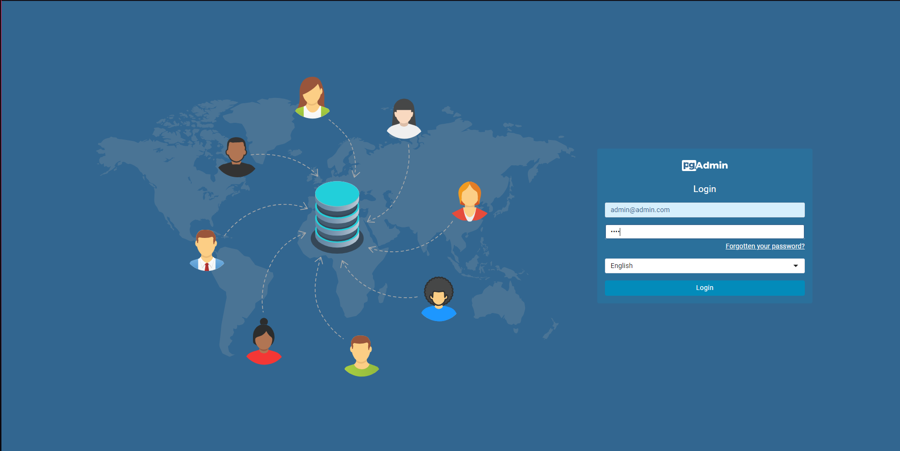
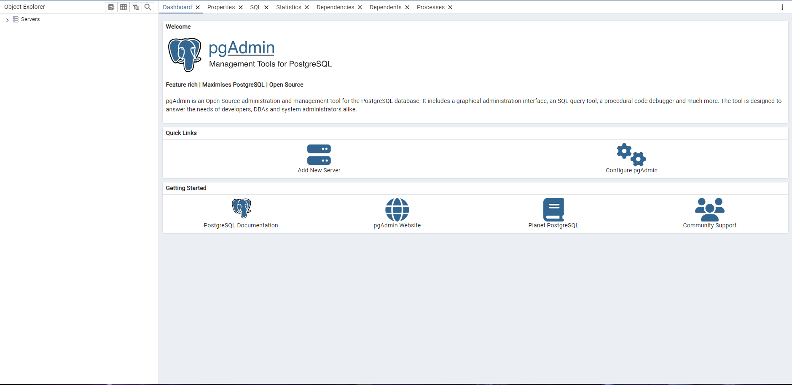
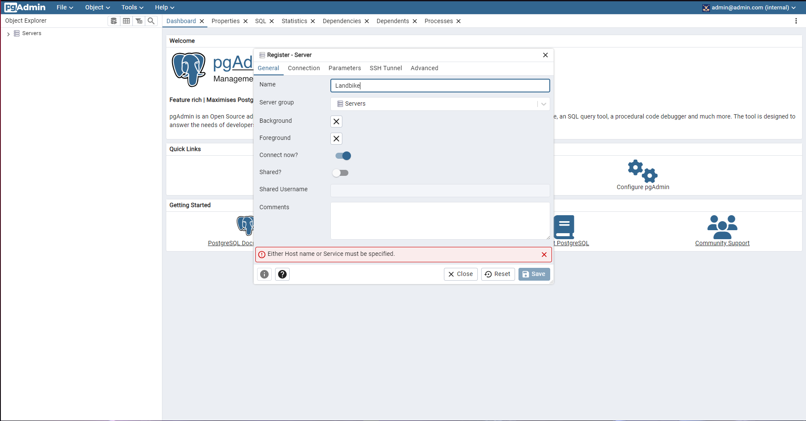
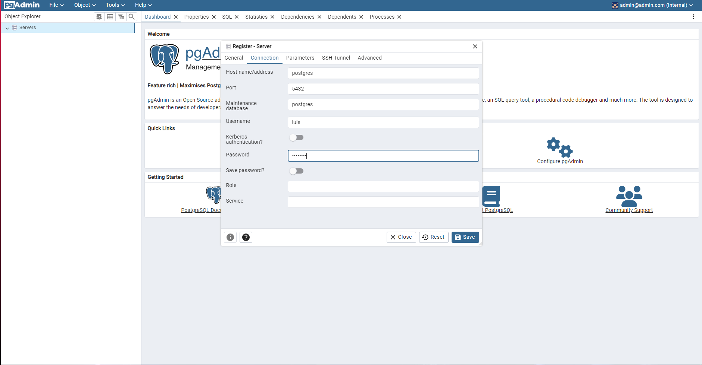
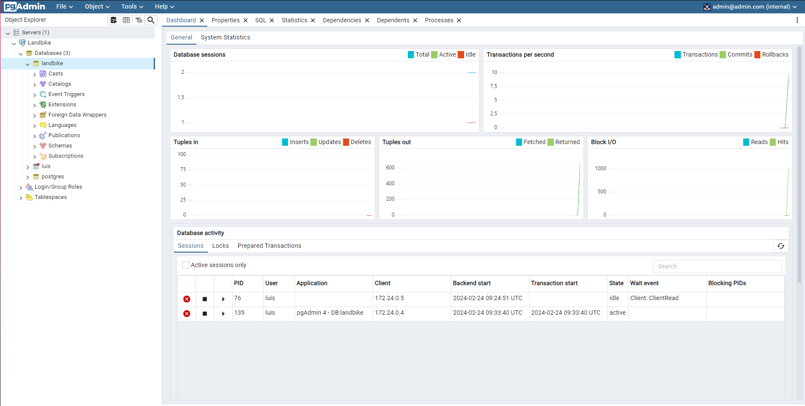
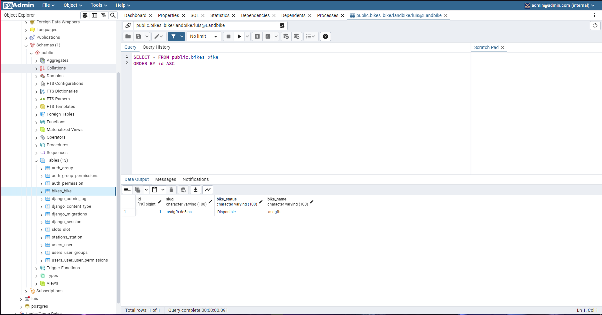

# LandBike

LandBike ofrece un servicio de alquiler de bicicletas eficiente y sostenible, aprovechando tecnologías de vanguardia como React.js, Django Rest Framework, Postgres, Bootstrap, y Docker.

## 🌟 Características Destacadas

- **Interfaz Intuitiva**: Implementada con React.js para asegurar una navegación fluida.
- **Servicios Backend**: Desarrollados con Django Rest Framework para una gestión eficaz de datos.
- **Gestión de Datos**: Postgres se encarga de almacenar información de manera segura.
- **Diseño Responsive**: Utilizamos Bootstrap para una estética moderna y adaptable.
- **Contenedores Docker**: Facilita el despliegue y manejo de entornos gracias a Docker.

## 🛠 Requisitos para el Entorno de Desarrollo

Es necesario contar con:

- Node.js y npm (necesarios para React.js)
- Docker

## 📦 Docker Compose Setup

El `docker-compose.yml` facilita la orquestación de servicios para la aplicación:

```yaml
version: '3.8'

services:
  postgres:
    image: postgres
    container_name: postgres_container
    environment:
      POSTGRES_USER: luis
      POSTGRES_PASSWORD: 178aj900
    volumes:
      - postgres_data:/var/lib/postgresql/data
      - ./postgresql/init.sql:/docker-entrypoint-initdb.d/init.sql
    ports:
      - "5433:5432"
    restart: always
    networks:
      - landbike_network

  backend:
    build:
      context: .
      dockerfile: Dockerfile
    container_name: backend_container
    volumes:
      - .:/app_django
    ports:
      - "8000:8000"
    command: sh -c "./wait-for-it.sh postgres:5432; python manage.py showmigrations; python manage.py makemigrations; python manage.py migrate; python manage.py runserver 0.0.0.0:8000"
    environment:
      - PG_USER=luis
      - PG_PASSWORD=178aj900
      - PG_DB=landbike
      - PG_PORT=5432
      - PG_HOST=postgres
    depends_on:
      - postgres
    restart: unless-stopped
    networks:
      - landbike_network


  frontend:
    build:
      context: ./Frontend
      dockerfile: Dockerfile
    container_name: frontend_container
    ports:
      - "5173:5173"
    restart: always
    networks:
      - landbike_network

  pgadmin:
    image: dpage/pgadmin4
    container_name: pgadmin4_container
    environment:
      PGADMIN_DEFAULT_EMAIL: 'admin@admin.com'
      PGADMIN_DEFAULT_PASSWORD: 'root'
    ports:
      - "5050:80"
    depends_on:
      - postgres
    restart: always
    networks:
      - landbike_network

  nginx:
    image: nginx:latest
    container_name: nginx_loadbalancer
    ports:
      - "8080:80"
    volumes:
      - ./loadbalancer/nginx.conf:/etc/nginx/nginx.conf:ro
    depends_on:
      - backend
      - frontend
    command: ["nginx", "-g", "daemon off;"]
    networks:
      - landbike_network

volumes:
  postgres_data:

networks:
  landbike_network:
    driver: bridge
```

## 🔧 Dockerfile para el Frontend

```yaml
# Utilizar node:20-alpine como base
FROM node:20-alpine

# Establecer el directorio de trabajo en el contenedor
WORKDIR /app/frontend

# Copiar los archivos de package.json y package-lock.json
COPY package*.json /app/frontend/

# Instalar dependencias del proyecto
RUN npm install

# Copiar el resto de los archivos del proyecto al contenedor
COPY . /app/frontend

# Exponer el puerto 5173
EXPOSE 5173

# Comando para arrancar la aplicación
CMD ["npm", "run", "dev"]
```


Este `Dockerfile` configura el entorno para ejecutar la interfaz de usuario de la aplicación LandBike. A continuación, se detallan los pasos involucrados:

### Base de la Imagen
```yaml
FROM node:20-alpine
```
Se utiliza node:20-alpine como imagen base. Alpine Linux es conocido por ser ligero y seguro, lo cual es ideal para asegurar tiempos de construcción rápidos y minimizar la superficie de ataque.

### Directorio de Trabajo
```yaml
WORKDIR /app/frontend
```
Establece /app/frontend como el directorio de trabajo. Todos los comandos que se ejecuten a continuación se harán en este directorio.

### Copia de Archivos de Dependencias
```yaml
COPY package*.json /app/frontend/
```
Copia package.json y package-lock.json (si existe) al directorio de trabajo en el contenedor. Esto se hace para aprovechar la caché de capas de Docker en las instalaciones de dependencias.

### Instalación de Dependencias
```yaml
RUN npm install
```
Ejecuta npm install para instalar las dependencias del proyecto, basándose en los archivos de paquetes copiados previamente.

### Copia del Proyecto
```yaml
COPY . /app/frontend
```
Copia el resto de los archivos del proyecto al contenedor, en el directorio de trabajo.

### Exposición del Puerto
```yaml
EXPOSE 5173
```
Expone el puerto 5173, que es el puerto en el que se ejecutará el servidor de desarrollo de React.

### Comando de Ejecución
```yaml
CMD ["npm", "run", "dev"]
```
Define el comando por defecto para arrancar la aplicación, que en este caso es npm run dev, para iniciar el servidor de desarrollo de React.

Este Dockerfile crea una imagen ligera utilizando node:20-alpine, instala las dependencias necesarias y configura el entorno para ejecutar el frontend en el puerto 5173.

## 🔧 Dockerfile para el Backend

```yaml
# Primera etapa: construir la aplicación
FROM python:3 AS builder

# Establecer salida sin búfer para Python
ENV PYTHONUNBUFFERED 1

# Instalar cliente PostgreSQL y los módulos Perl requeridos
RUN apt-get update && apt-get install -y postgresql-client libdbd-pg-perl

# Crear directorio de la aplicación
WORKDIR /app

# Instalar las dependencias de la aplicación
COPY requirements.txt .

RUN pip install --no-cache-dir -r requirements.txt

# Agrupar el código fuente de la aplicación
COPY . .

# Segunda etapa: crear la imagen final
FROM python:3-slim

COPY --from=builder /app/requirements.txt /app_django/requirements.txt

# Instalar Django y otras dependencias necesarias
RUN apt-get update && apt-get install -y postgresql-client libdbd-pg-perl \
    && pip install --no-cache-dir -r /app_django/requirements.txt

# Crear directorio de la aplicación
WORKDIR /app_django

# Copiar solo los archivos necesarios de la etapa de construcción
COPY --from=builder /app /app_django

COPY django_script.sh .
COPY wait-for-postgres.sh .

# Establecer permisos ejecutables para los scripts
RUN chmod +x /app_django/django_script.sh
RUN chmod +x /app_django/wait-for-postgres.sh

# Exponer puerto
EXPOSE 8000

# Entrypoint para ejecutar el archivo django.sh
# ENTRYPOINT ["/bin/sh", "/app_django/django_script.sh"]
# CMD ["/bin/sh", "/app_django/django_script.sh"]
```


Este `Dockerfile` prepara el entorno para ejecutar el servicio backend de la aplicación LandBike, utilizando una estrategia de construcción en dos etapas.

### Primera Etapa: Construcción
```yaml
FROM python:3 AS builder
```
Usa python:3 como imagen base para la etapa de construcción, donde se instalan las dependencias y se prepara el entorno de construcción.

### Configuración del Entorno y Dependencias
```yaml
ENV PYTHONUNBUFFERED 1
RUN apt-get update && apt-get install -y postgresql-client libdbd-pg-perl
WORKDIR /app
COPY requirements.txt .
RUN pip install --no-cache-dir -r requirements.txt
COPY . .
```
Establece variables de entorno, instala dependencias del sistema necesarias, copia los archivos de requisitos de Python, instala las dependencias de Python, y luego copia el código fuente del proyecto.

### Segunda Etapa: Imagen Final
```yaml
FROM python:3-slim
```
Comienza con python:3-slim para la etapa final, ofreciendo una base ligera para la imagen de producción.

### Preparación y Copia de la Aplicación
```yaml
COPY --from=builder /app/requirements.txt /app_django/requirements.txt
RUN apt-get update && apt-get install -y postgresql-client libdbd-pg-perl \
    && pip install --no-cache-dir -r /app_django/requirements.txt
WORKDIR /app_django
COPY --from=builder /app /app_django
```
Copia las dependencias instaladas y el código fuente desde la etapa de construcción, instala nuevamente las dependencias del sistema necesarias y las dependencias de Python utilizando pip.

### Scripts y Permisos
```yaml
COPY django_script.sh .
COPY wait-for-postgres.sh .
RUN chmod +x /app_django/django_script.sh
RUN chmod +x /app_django/wait-for-postgres.sh
```
Copia scripts adicionales que pueden ser necesarios para la inicialización del proyecto y establece los permisos necesarios para ejecutarlos.

### Exposición del Puerto y Comando de Ejecución
```yaml
EXPOSE 8000
```
Expone el puerto 8000, que es el puerto en el que se ejecutará el servidor de Django.


Este Dockerfile utiliza una imagen base python:3 para construir y ejecutar la aplicación, optimizando la imagen final al copiar solo los archivos necesarios desde la etapa de construcción. Además, se instalan las dependencias necesarias y se configura el entorno para ejecutar el backend en el puerto 8000.


## 🚀 Instrucciones de Instalación
Para desplegar LandBike en tu entorno local, sigue estos pasos:

Clone el repositorio: 
```
git clone https://github.com/Luisfcaro/LandBike_DRF_React_PostgreSQL.git
```

Cambie al directorio del proyecto: 
```
cd LandBike_DRF_React_PostgreSQL
```

Seleccione la rama adecuada:
```
git checkout -t origin/main_docker_compose
```

Instale las dependencias necesarias para el frontend:
```
cd ./Frontend && npm install
```

## 🖥 Ejecución
Nota: El proyecto se encuentra en una fase beta, lo que podría limitar algunas funcionalidades.

Para iniciar la aplicación:

Ejecute Docker Compose (Esto debe realizarse en la carpeta Raíz del proyecto): 
```
docker-compose up --build
```

Acceda a la interfaz principal a través de localhost:8080 y explore las diferentes secciones de la página web. Le recomendamos que intente crear una bici

## ⚙ Configuraciones Adicionales tras la ejecucion y pruebas
Acontinuación le expondremos las configuraciones pertinentes de PGAdmin 4, para que pueda visualizar sus datos correctamente:

### Acedemos a PGAdmin
Si accedemos a localhost:5050, tendremos a nuestra disposición el panel de login de PGAdmin, donde deberemos introducir las siguientes credenciales:

- Usuario: admin@admin.com
- Contraseña: root



### Panel de inicio
Ahora nos encontraremos en el panel de inicio, para poder visualizar nuestros datos deberemos añadir un servidor, para ello, pulsaremos en "add server"



### Configuración inicial del servidor

Como podremos apreciar, se nos habra abierto un modal, a continuación, en el apartado "name", escribiremos de que forma deseamos llamar al servidor.



Tras esto, nos dirigiremos al apartado "Connection", en donde especificaremos los siguientes datos:

- Host name/adress: postgres
- Username: luis
- Password: 178aj900



Y pulsaremos "Save".

Tras esto si desplegamos nuestro servidor y la base de datos "landbike", obtendremos una vista como la siguiente.



A continuación, si hemos seguido las recomendaciones especificadas anteriormente en el apartado de ejecución, podremos dirigirnos a "landbike > Schemas > public > Tables" y pulsamos click derecho sobre la tabla "bikes_bike" y seleccionamos "View/Edit Data > All Rows" podremos observar los datos de nuestra tabla.



## 🎫 Servicios y Puertos de LandBike

A continuación, se detallan los servicios disponibles en la aplicación LandBike y los puertos a través de los cuales se pueden acceder:

| Servicio  | Descripción                            | Puerto Local |
|-----------|----------------------------------------|--------------|
| Frontend  | Interfaz de usuario de LandBike, desarrollada con React.js. | 5173         |
| Backend   | API y lógica del negocio, implementada con Django Rest Framework. | 8000         |
| Postgres  | Base de datos PostgreSQL para la gestión eficiente de datos. | 5433         |
| pgAdmin   | Herramienta de gestión para Postgres, facilita la administración de la base de datos. | 5050         |
| LoadBalancer| Actua como proxy, permitiendonos acceder a todas las funcionalidades y servicios de la aplicación a traves de su puerto | 8080 |

Este esquema facilita la comprensión de los diferentes componentes de la aplicación y cómo cada uno contribuye a la funcionalidad general de LandBike. Asegúrate de tener los puertos correspondientes disponibles y configurados correctamente en tu entorno de desarrollo para evitar conflictos.


## 💡 ¿Cómo Contribuir?
Tus ideas y sugerencias son valiosas para nosotros. Si tienes propuestas de mejora o encuentras algún problema, no dudes en abrir un issue o enviar un pull request.

Este formato mantiene toda la información esencial del proyecto y su configuración, presentada de manera clara y estructurada para facilitar su lectura y comprensión. Se han hecho pequeñas adaptaciones para mejorar la legibilidad y la apariencia visual del documento, siguiendo las convenciones de archivos Markdown para GitHub.


